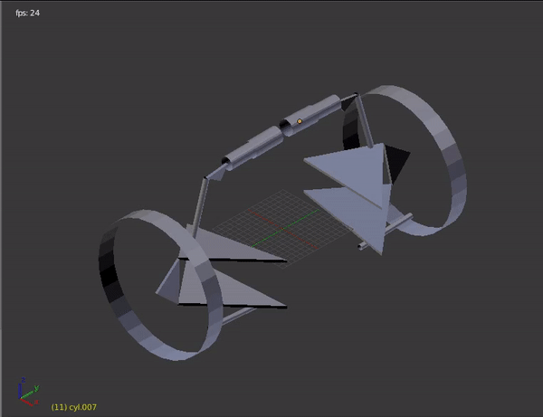
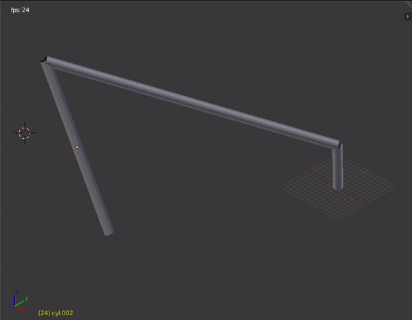

# **SMBD** | Symbolic Multi-Body Dynamics

## Description

**smbd** is a python package developed for the creation, simulation and visualization of multi-body systems.

A multi-body system is hereby defined as *a finite number of material bodies connected in an arbitrary fashion by mechanical joints that limit the relative motion between pairs of bodies*. Practitioners of multi-body dynamics study the generation and solution of the equations governing the motion of such systems [1].

### Audience and Fields of Application

Initially, the main targeted audience was the **Formula Student** community. The motive was *encouraging a deeper understanding of the modeling processes and the underlying theories used in other commercial software packages*, which is a way of giving back to the community, and supporting the concept of *"knowledge share"* adopted there by exposing it to the open-source community as well.

Currently, the tool aims to serve a wider domain of users with different usage goals and different backgrounds, such as students, academic researchers and industry professionals.

Fields of application include any domain that deals with the study of interconnected bodies, such as:

- Ground Vehicles' Systems.
- Construction Equipment.
- Industrial Mechanisms.
- Robotics.
- Biomechanics.
- .. etc.

### Features 

Currently, the tool provides:

#### Symbolic Model Creation

- Creation of template-based and stand-alone multibody systems using minimal API via python scripting.
- Convenient and easy creation of complex multibody assemblies.
- Convenient visualization of the system topology as a network graph.
- Viewing the system's symbolic equations in a natural mathematical format using Latex printing.
- Optimization of the system equations by performing common sub-expressions elimination.
- Creation of symbolic configuration files to facilitate the process of numerical configuration data entry.

#### Numerical Code Generation and Model Simulation

- A python code-generator that creates an object-oriented code structure of the symbolic systems.
- A python solver that can be used to solve for *Kinematically  and Dynamically Driven Systems* using the NumPy and SciPy libraries for numerical evaluation.

#### 3D Visualization

*"Requires the installation of  [blender](https://www.blender.org/). It is free and open-source."*

- A blender code-generator for the creation of valid blender scripts that can be used for 3D visualizations in blender.
- A blender add-on that can be easily added to blender's GUI, to facilitate the visualization process of the simulated systems.

##### Animation Samples
**Double-Wishbone Bell-Crank Actuated Front-Axle**
</br>


**Spatial Fourbar Mechanism**
</br>


#### Development Environment

- Easy construction of new, user-defined joints and actuators.
- A modular development environment that adopts the *"programming to an interface instead of an implementation"* concept, resulting in a flexible, loosely-coupled code structure. 

------


## Background
### The Whats and The Hows ?

#### What is Computational Dynamics?

Computational Dynamics is a rapidly developing field that brings together applied mathematics (especially numerical analysis), computer science, and scientific or engineering applications. Multibody Dynamics can be considered as a sub-field of computational dynamics.
#### What is the problem to be solved?
The primary interest in multibody dynamics is to analyze the system behavior for given inputs. In analogy with control systems; a multi-body system can be thought as a **_system_** subjected to some **_inputs_** producing some **_outputs_**. These three parts of the problem are dependent on the analyst end goal of the analysis and simulation. 
#### How is the system physics abstracted mathematically?
An unconstrained body in space is normally defined using 6 generalized coordinates defining its location and orientation. For example, a system of 10 bodies requires 60 generalized coordinates to be fully defined, which in turn requires 60 *independent equations* to be solved for these  -unknown- generalized coordinates.

The way we achieve a solution for the system is dependent on the type of study we are performing. Mainly we have **four types** of analysis that are of interest for a given multi-body system. These are:

- **Kinematic Analysis**</br>
  *"How does the whole system move if we moved this particular body ?"*
- **Inverse Dynamic Analysis**</br>
  *"What are the forces needed to achieve this motion we just did ?"*
- **Equilibrium Analysis**</br>
  *"How does the system look if we did nothing ?"*
- **Dynamic Analysis**</br>
  *"Now we gave it a force, how does it behave ?"*

Each analysis type -or question- can be modeled by a set of algebraic and/or differential equations that can be solved for the system generalized states (positions, velocities and accelerations). A more detailed discussion of each analysis type will be provided in another documentation.

### Approach
The philosophy of the tool is to isolate the model creation process form the actual numerical and computational representation of the system that will be used in the simulation process. This is done through the ideas of symbolic computing and code-generation as well be shown below.

#### Model Creation

The topology of the system is represented as a multi-directed graph, where each node represents a body and each edge represents a connection between the end nodes, where this connection may represents a joint, actuator or a force element. This serves mainly two aspects:

1. A natural way to create and represent the topology of a given multibody system.
2. A convenient way to abstract the system programmatically, where all the topological data of the system are stored in a graph.

The tool achieves this by making heavy use the [NetworkX](https://networkx.github.io/documentation/stable/index.html) python package to create topology graphs and to construct the governing equations of the system. The equations themselves are represented symbolically by using [SymPy](https://www.sympy.org/en/index.html), which is a Python library for symbolic mathematics.

The combination of both, NetworkX and SymPy, provides the tool with a very simple, easy-to-use and convenient interface for the process of model creation and topology design, where the user only focuses on the validity of the system topology in hand, as he thinks only in terms of the topological components - bodies, joints, actuators and forces-, without the burden of frequent numerical inputs for each component, or how the actual system is configured in space. In short, the tool divide the typical model creation process in halves, the system topology design and the system configuration assignment.

#### Code Generation and Model Simulation

The process of performing actual simulations on the created model requires the generation of a valid numerical and computational code of the created model. This is done by taking in the symbolic model and create a valid code files written in the desired programming language with the desired programming paradigm and structure. Currently, the tool provides a *Python Code Generator* that generates an object oriented python code of the symbolic multibody system that can be used to perform the desired simulations.

#### Conclusion

Several benefits of the adopted approach can be stated here, but the major theme here is the flexibility and modularity, in both software usage and software development. These can be summarized as follows:

- The distinction between the topology design phase and the configuration assignment phase, which gives proper focus for each at its' own.
- Natural adoption of the template-based modeling theme that emerges from the use of network-graphs to represent the system, which allows convenient assemblage of several graphs to form a new system. 
- Uncoupled simulation environment, where the symbolic equations generated form the designed topology is free to be written in any programming language with any desired numerical libraries.

## Installation

### Using the tool on [Colab](https://colab.research.google.com)

Colaboratory is a free Jupyter notebook environment that requires no setup and runs entirely in the cloud [2]. So, if you do not have an up and running python environment, you still can check out the tool and create multibody systems seamlessly. 

The examples section below, has several ready-to-use Colab notebooks that walks you through a typical modeling process flow.

### Using the tool on your machine.

The tool needs a valid python 3.6+ environment. If new to scientific computing in python, [Anaconda](https://www.anaconda.com/download/) is a recommended free python distribution from Continuum Analytics that includes SymPy, SciPy, NumPy, Matplotlib, and many more useful packages for scientific computing, which provides a nice coherent platform with most of the tools needed.

#### Git

As the tool is still under continuous development, cloning this repository is a more versatile way to test and play with it, until a more stable first release is released. This can be done via the following git commands from the command line.

```bash
git clone https://github.com/khaledghobashy/smbd.git
```

```bash
git pull origin master
```

Or alternatively, download the repository as a **zip** file and extract it on your machine.

Then, if creating a new python session to use the tool, add the directory path where the tool exists to the python system path.

```python
import sys
pkg_path = 'path/to/smbd'
if pkg_path not in sys.path:
    sys.path.append(pkg_path)

# the package can now be imported as asurt, e.g. :
# from smbd.interfaces.scripting import standalone_topology
```


#### Pip

*To Do.*

#### Conda

*To Do*

## Usage Examples & Tutorials

This is a list of ready-to-use jupyter notebooks that walks you through the typical flow of the tool modeling process. The [**examples**](https://github.com/khaledghobashy/smbd/tree/master/examples) directory in this repository is planned to include updated versions of working models that can be statically viewed on github, downloaded on your machine or to be ran directly on Colab.

- Getting Started. (GitHub | Colab)

### Standalone Studies

- **Spatial Four-bar**. ([**GitHub**](https://github.com/khaledghobashy/smbd/blob/master/examples/spatial_fourbar/spatial_fourbar.ipynb) | [**Colab**](https://colab.research.google.com/github/khaledghobashy/smbd/blob/master/examples/spatial_fourbar/spatial_fourbar.ipynb))
- **Spatial Slider-Crank**. ([**GitHub**](https://github.com/khaledghobashy/smbd/blob/master/examples/spatial_slider_crank/spatial_slider_crank.ipynb)| [**Colab**](https://colab.research.google.com/github/khaledghobashy/smbd/blob/master/examples/spatial_slider_crank/spatial_slider_crank.ipynb))
- **Stewart-Gough Platform**. ([**GitHub**](https://github.com/khaledghobashy/smbd/blob/master/examples/stewart_gough/stewart_gough.ipynb)| [**Colab**](https://colab.research.google.com/github/khaledghobashy/smbd/blob/master/examples/stewart_gough/stewart_gough.ipynb#scrollTo=A5aeLp5S45eh))

### Template-Based Studies

#### Vehicle Front Axle. ([GitHub](https://github.com/khaledghobashy/asurt_mbdt/tree/master/examples/vehicle_front_axle) | Colab)

- Template-Based Topology - "double-wishbone vehicle suspension". 
- Template-Based Topology - "suspension actuation test-rig". 
- Symbolic Assembly - "vehicle front-axle assembly".
- Numerical Simulation - "vehicle front axle kinematics". 

### 3D Visualization

*To be discussed ...*

## Implementation Details

*The **Implementation Details** will be provided in a separate documentation and linked here*

## Theoretical Basis

*The **Theoretical Basis** will be provided in a separate documentation and linked here*

## License

**SMBD** is distributed under the 3-clause BSD license. See the [LICENSE](LICENSE) file for details.

